# Like Hero To Zero - CO2 Emissions Tracker

A Java web application for visualizing and managing global CO2 emissions data. This application provides public access to view emission data by country, while registered scientists can contribute and update the dataset.

## Features

### Public Access
- **View CO2 Emissions**: Browse the latest available CO2 emission data for countries worldwide
- **No Authentication Required**: Public data is accessible to everyone without login

### Registered Scientists
- **Secure Login & Registration**: Authentication system for verified contributors
- **Data Management**: Add new emission data and update existing records
- **Review Workflow**: Submit data changes for review before publication (optional feature)

## Architecture





## Technology Stack

- **Frontend**: JavaServer Faces (JSF) with XHTML templates
- **Backend**: Jakarta EE 10 with CDI/Beans
- **Persistence**: JPA with Hibernate
- **Database**: MySQL (relational database)
- **Server**: Open Liberty
- **Build Tool**: Maven

## Data Source

The application uses the [Our World in Data CO2 Dataset](data/owid-co2-data.csv), providing comprehensive global CO2 emission statistics.

## Setup

### Prerequisites
- Java 21
- Maven
- Docker (for mysql database)

### Build and Run

1. **Start the database**:
   ```bash
   cd docker
   docker compose up -d
   ```

2. **Build the application**:
   ```bash
   mvn clean package
   ```
  ```bash
  mvn liberty:dev
   ```
 
3. **Deploy to Liberty server**:
   The application will be deployed to Open Liberty and accessible at `http://localhost:9080/herotozero`

## Project Structure

- `src/main/java/de/niklas/` - Java source code
  - `bean/` - JSF managed beans (Login, Register, Review, Add Data)
  - `model/` - JPA entities (User, Country, EmissionData)
  - `service/` - Business logic services
- `src/main/webapp/` - Web pages and resources
- `src/main/resources/META-INF/` - Configuration files
- `data/` - CO2 emissions dataset
- `docs/` - Documentation and diagrams


